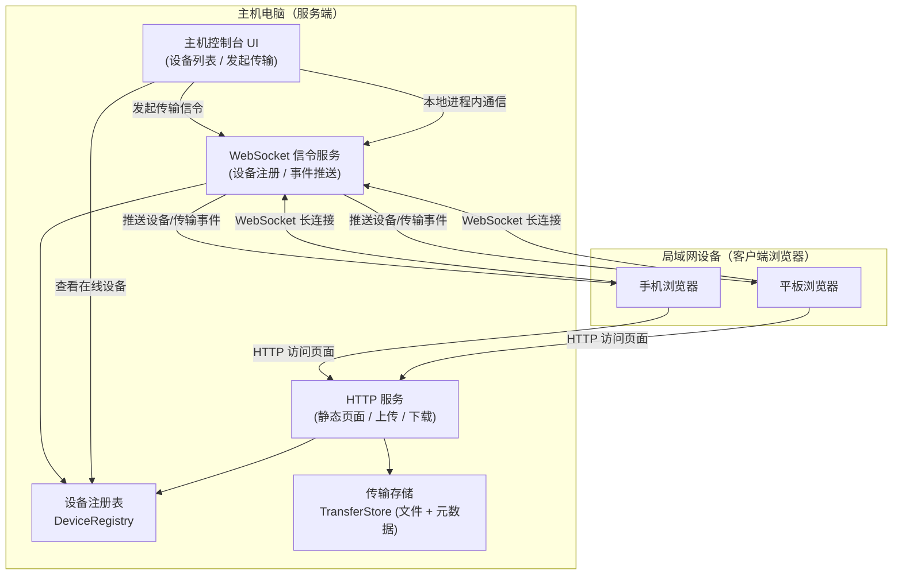
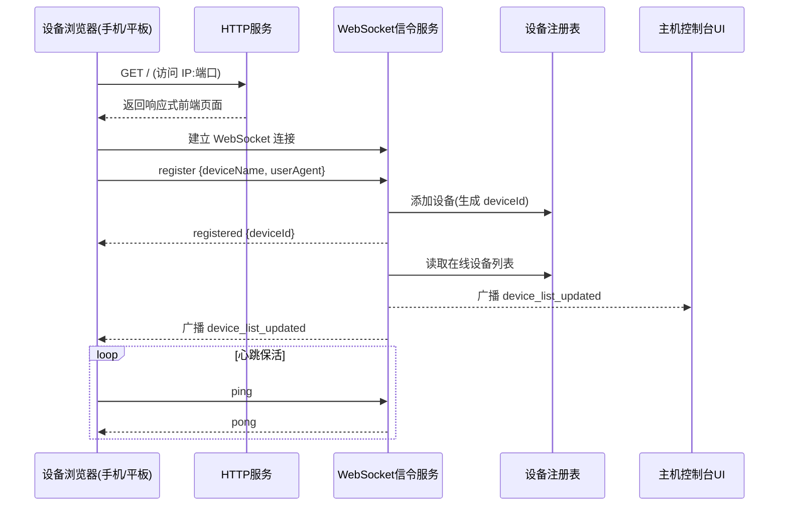
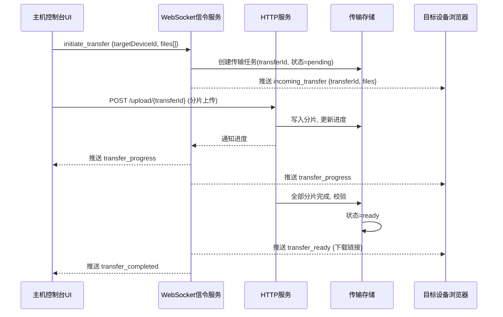
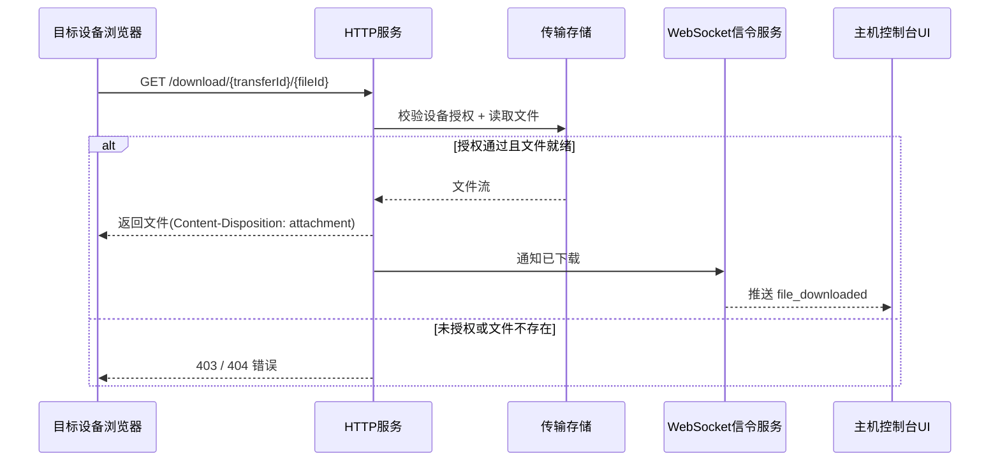

# 设计文档：局域网文件传输系统（lan-file-transfer / 品牌名「飞传 FlyDrop」）

> 📌 本文前半部分为**语言无关的原始设计**（结构化伪代码）。项目已落地实现，实际技术栈、协议与端点的最终形态见文末「[实现现状（Implementation）](#实现现状implementation)」章节——以该章节为实现的权威依据。

## Overview

本系统是一个运行在用户电脑（主机/服务端）上的局域网文件与图片传输程序。主机启动后会在指定端口提供 Web 服务，局域网内的其他设备（手机、平板等）通过浏览器输入 `主机局域网IP:端口` 即可访问，无需安装任何客户端程序。

设备连入后会自动出现在主机的设备列表中（设备发现）。主机端可以选择某个已连入的设备发起文件传输；传输完成后，目标设备可在浏览器中下载收到的文件。整个前端采用响应式设计，自适应手机与平板等不同尺寸的屏幕。

系统的核心技术取向：以 HTTP 提供静态页面与文件上传/下载的可靠通道，以 WebSocket 提供实时的设备在线状态、设备列表更新与传输事件推送。文件本身通过 HTTP 分片传输以支持大文件与断点能力，控制信令通过 WebSocket 实时下发。本设计为语言无关设计，底层算法以结构化伪代码（Structured Pseudocode）表达。

---

## Architecture



架构说明：

- **HTTP 服务**：托管响应式前端页面、处理文件分片上传与下载请求。文件传输走 HTTP 是因为它对大文件、断点续传、浏览器原生下载支持最好。
- **WebSocket 信令服务**：维护每个连入设备的长连接，负责设备注册、心跳保活、在线状态广播、设备列表同步、传输事件（开始/进度/完成/失败）实时推送。
- **设备注册表（DeviceRegistry）**：内存中维护当前在线设备列表，是设备发现的核心数据源。
- **传输存储（TransferStore）**：保存传输任务的元数据与文件内容（或文件在磁盘上的引用），供目标设备下载。
- **主机控制台 UI**：主机本机查看设备列表、选择目标设备、发起文件传输的界面。

---

## Sequence Diagrams（时序图）

### 流程 1：设备连入与设备发现



### 流程 2：主机向设备发起文件传输



### 流程 3：目标设备下载文件



---

## Components and Interfaces

### 组件 1：DeviceRegistry（设备注册表）

**职责**：管理所有连入设备的生命周期与在线状态，是设备发现的唯一数据源。

**接口**：

```pascal
INTERFACE DeviceRegistry
  registerDevice(connectionId, deviceInfo): Device
  removeDevice(deviceId): Boolean
  getDevice(deviceId): Device OR Null
  listOnlineDevices(): List<Device>
  updateHeartbeat(deviceId, timestamp): Boolean
  pruneStaleDevices(now, timeoutMs): List<DeviceId>   // 移除超时未心跳的设备
END INTERFACE
```

**责任**：
- 为每个新连接生成唯一 `deviceId`。
- 维护设备的在线/离线状态与最近心跳时间。
- 提供在线设备列表查询。
- 清理超时设备并触发列表更新事件。

### 组件 2：SignalingService（WebSocket 信令服务）

**职责**：处理所有实时双向通信，包括注册、心跳、设备列表广播与传输事件推送。

**接口**：

```pascal
INTERFACE SignalingService
  onConnect(connection): Void
  onMessage(connection, message): Void
  onDisconnect(connection): Void
  broadcastDeviceList(): Void
  sendToDevice(deviceId, event): Boolean
  broadcastToAll(event): Void
END INTERFACE
```

**责任**：
- 解析并路由客户端消息（register / ping / initiate_transfer 等）。
- 在设备上线、下线、列表变化时广播 `device_list_updated`。
- 将传输事件精准推送给相关设备与主机控制台。

### 组件 3：TransferStore（传输存储）

**职责**：管理传输任务的元数据与文件数据，支持分片写入、完整性校验与下载读取。

**接口**：

```pascal
INTERFACE TransferStore
  createTransfer(targetDeviceId, fileMetaList): Transfer
  writeChunk(transferId, fileId, chunkIndex, data): ChunkResult
  isFileComplete(transferId, fileId): Boolean
  finalizeTransfer(transferId): Transfer
  getTransfer(transferId): Transfer OR Null
  openFileStream(transferId, fileId): Stream OR Null
  authorizeDownload(transferId, requestingDeviceId): Boolean
  cleanupExpired(now, ttlMs): List<TransferId>
END INTERFACE
```

**责任**：
- 创建传输任务并分配 `transferId` / `fileId`。
- 按分片接收文件并记录已接收分片，支持断点续传。
- 校验文件完整性（分片数、大小、可选校验和）。
- 校验下载请求方的授权（只有传输目标设备可下载）。
- 清理过期任务释放空间。

### 组件 4：HttpFileService（HTTP 文件服务）

**职责**：托管前端静态资源，处理分片上传与文件下载。

**接口**：

```pascal
INTERFACE HttpFileService
  serveStaticPage(request): HttpResponse
  handleUploadChunk(transferId, fileId, chunkIndex, totalChunks, body): HttpResponse
  handleDownload(transferId, fileId, requestingDeviceId): HttpResponse
END INTERFACE
```

**责任**：
- 返回响应式前端页面与静态资源。
- 接收分片上传请求，转发给 TransferStore。
- 处理下载请求，做授权校验后返回文件流。

### 组件 5：HostConsoleUI（主机控制台前端）/ DeviceClientUI（设备端前端）

**职责**：提供响应式用户界面。

- **HostConsoleUI**：展示在线设备列表、选择目标设备、选择本地文件、显示传输进度。
- **DeviceClientUI**：注册设备名、显示收到的传输、提供下载入口、显示传输进度，使用响应式布局适配手机与平板。

```pascal
INTERFACE DeviceClientUI
  connectAndRegister(deviceName): Void
  renderIncomingTransfers(transfers): Void
  downloadFile(transferId, fileId): Void
  onProgressEvent(event): Void
END INTERFACE
```

---

## Data Models

### 模型 1：Device（设备）

```pascal
STRUCTURE Device
  deviceId: UUID            // 服务端生成的唯一标识
  connectionId: String      // 对应 WebSocket 连接标识
  deviceName: String        // 用户可读名称, 如 "Alice 的 iPhone"
  deviceType: Enum {PHONE, TABLET, DESKTOP, UNKNOWN}
  ipAddress: String         // 局域网 IP
  status: Enum {ONLINE, OFFLINE}
  connectedAt: Timestamp
  lastHeartbeatAt: Timestamp
END STRUCTURE
```

**校验规则**：
- `deviceId` 全局唯一且非空。
- `deviceName` 非空，长度 1–64；若客户端未提供，则用 `deviceType + 序号` 生成默认名。
- `deviceType` 由 `userAgent` 推断，失败时为 `UNKNOWN`。
- `lastHeartbeatAt` 不得早于 `connectedAt`。

### 模型 2：Transfer（传输任务）

```pascal
STRUCTURE Transfer
  transferId: UUID
  targetDeviceId: UUID            // 接收方设备
  sourceDeviceId: UUID OR Null    // 发起方(主机为 Null 或特殊 HOST 标识)
  files: List<FileMeta>
  status: Enum {PENDING, UPLOADING, READY, COMPLETED, FAILED, EXPIRED}
  createdAt: Timestamp
  expiresAt: Timestamp
END STRUCTURE
```

**校验规则**：
- `files` 至少包含 1 个 `FileMeta`。
- `targetDeviceId` 必须指向一个在创建时刻存在的设备。
- 状态机仅允许合法转移（见错误处理与算法部分）。
- `expiresAt > createdAt`。

### 模型 3：FileMeta（文件元数据）

```pascal
STRUCTURE FileMeta
  fileId: UUID
  fileName: String
  mimeType: String
  totalSize: Integer            // 字节
  totalChunks: Integer
  receivedChunks: Set<Integer>  // 已接收分片索引
  checksum: String OR Null      // 可选, 用于完整性校验
  status: Enum {PENDING, UPLOADING, COMPLETE, ERROR}
END STRUCTURE
```

**校验规则**：
- `fileName` 非空且经过安全过滤（去除路径分隔符，防止目录穿越）。
- `totalSize >= 0`，`totalChunks >= 1`。
- `receivedChunks` 中每个索引满足 `0 <= index < totalChunks`。
- 当 `|receivedChunks| == totalChunks` 时文件才可标记为 `COMPLETE`。

### 模型 4：WebSocket 事件消息

```pascal
STRUCTURE ClientMessage
  type: Enum {REGISTER, PING, INITIATE_TRANSFER, ACK_TRANSFER}
  payload: Object
END STRUCTURE

STRUCTURE ServerEvent
  type: Enum {REGISTERED, PONG, DEVICE_LIST_UPDATED,
              INCOMING_TRANSFER, TRANSFER_PROGRESS,
              TRANSFER_READY, TRANSFER_COMPLETED,
              TRANSFER_FAILED, FILE_DOWNLOADED}
  payload: Object
END STRUCTURE
```

---

## 底层设计（核心算法 / 关键函数 / 伪代码）

本节使用结构化伪代码（Structured Pseudocode），所有代码块以 `pascal` 标注。

### 关键函数及形式化规约

#### 函数 1：registerDevice()

```pascal
FUNCTION registerDevice(connectionId, deviceInfo): Device
```

**前置条件（Preconditions）**：
- `connectionId` 非空，且对应一个已建立的 WebSocket 连接。
- `deviceInfo` 非空，可能包含 `deviceName` 与 `userAgent`。

**后置条件（Postconditions）**：
- 返回的 `Device` 拥有全局唯一 `deviceId`，且 `status == ONLINE`。
- 该设备被加入注册表，`listOnlineDevices()` 结果中包含它。
- `connectedAt == lastHeartbeatAt == now()`。
- 触发一次设备列表广播（由调用方或本函数内保证）。

**循环不变式**：无（不含循环）。

#### 函数 2：writeChunk()

```pascal
FUNCTION writeChunk(transferId, fileId, chunkIndex, data): ChunkResult
```

**前置条件**：
- `transferId` 指向状态为 `PENDING` 或 `UPLOADING` 的传输任务。
- `fileId` 属于该任务的 `files`。
- `0 <= chunkIndex < fileMeta.totalChunks`。

**后置条件**：
- `chunkIndex` 被加入 `fileMeta.receivedChunks`（幂等：重复写入同一分片不破坏状态）。
- 若所有分片接收完毕，`fileMeta.status` 变为 `COMPLETE`。
- 返回结果包含当前文件接收进度 `receivedChunks / totalChunks`。
- 不修改其它文件或其它传输任务的状态。

**循环不变式**：无（单次分片写入）。

#### 函数 3：authorizeDownload()

```pascal
FUNCTION authorizeDownload(transferId, requestingDeviceId): Boolean
```

**前置条件**：
- `requestingDeviceId` 来自请求中携带的、已注册设备标识。

**后置条件**：
- 当且仅当 `transfer` 存在、状态为 `READY` 或 `COMPLETED`、且 `transfer.targetDeviceId == requestingDeviceId` 时返回 `true`。
- 不修改任何状态（纯查询函数，无副作用）。

**循环不变式**：无。

#### 函数 4：pruneStaleDevices()

```pascal
FUNCTION pruneStaleDevices(now, timeoutMs): List<DeviceId>
```

**前置条件**：
- `now` 为当前时间戳，`timeoutMs > 0`。

**后置条件**：
- 所有满足 `now - lastHeartbeatAt > timeoutMs` 的设备被移除并返回其 `deviceId` 列表。
- 移除后这些设备不再出现在 `listOnlineDevices()` 中。
- 未超时设备保持不变。

**循环不变式**：遍历设备集合时，已检查的设备要么被保留（未超时），要么被加入移除列表（已超时）；尚未检查的设备状态不变。

### 算法伪代码

#### 算法 1：设备注册主流程

```pascal
ALGORITHM registerDevice(connectionId, deviceInfo)
INPUT: connectionId (String), deviceInfo (Object)
OUTPUT: device (Device)

BEGIN
  ASSERT connectionId IS NOT NULL AND connectionId != ""

  // 步骤 1: 生成唯一标识
  deviceId ← generateUUID()

  // 步骤 2: 推断设备类型与名称
  deviceType ← inferDeviceType(deviceInfo.userAgent)
  IF deviceInfo.deviceName IS NULL OR deviceInfo.deviceName = "" THEN
    deviceName ← buildDefaultName(deviceType, registry.size + 1)
  ELSE
    deviceName ← sanitizeName(deviceInfo.deviceName)
  END IF

  // 步骤 3: 构造设备记录
  now ← currentTimestamp()
  device ← Device {
    deviceId: deviceId,
    connectionId: connectionId,
    deviceName: deviceName,
    deviceType: deviceType,
    ipAddress: deviceInfo.ipAddress,
    status: ONLINE,
    connectedAt: now,
    lastHeartbeatAt: now
  }

  // 步骤 4: 加入注册表
  registry.put(deviceId, device)

  ASSERT registry.contains(deviceId)
  ASSERT device.status = ONLINE

  // 步骤 5: 广播设备列表更新
  broadcastDeviceList()

  RETURN device
END
```

**前置条件**：`connectionId` 有效且非空。
**后置条件**：设备已加入注册表且在线；已触发列表广播。
**循环不变式**：N/A。

#### 算法 2：发起传输信令处理

```pascal
ALGORITHM handleInitiateTransfer(sourceDeviceId, targetDeviceId, fileMetaList)
INPUT: sourceDeviceId, targetDeviceId, fileMetaList (List<FileMeta>)
OUTPUT: transfer (Transfer)

BEGIN
  ASSERT fileMetaList IS NOT EMPTY

  // 步骤 1: 校验目标设备在线
  target ← registry.getDevice(targetDeviceId)
  IF target IS NULL OR target.status != ONLINE THEN
    sendError(sourceDeviceId, "目标设备不在线")
    RETURN NULL
  END IF

  // 步骤 2: 创建传输任务
  transfer ← transferStore.createTransfer(targetDeviceId, fileMetaList)
  transfer.sourceDeviceId ← sourceDeviceId
  transfer.status ← PENDING

  // 步骤 3: 通知目标设备有新的传入传输
  sendToDevice(targetDeviceId, ServerEvent {
    type: INCOMING_TRANSFER,
    payload: { transferId: transfer.transferId, files: fileMetaList }
  })

  ASSERT transferStore.getTransfer(transfer.transferId) IS NOT NULL

  RETURN transfer
END
```

**前置条件**：`fileMetaList` 非空。
**后置条件**：若目标在线，创建任务并通知目标设备；否则返回错误且不创建任务。
**循环不变式**：N/A。

#### 算法 3：分片上传与完整性校验

```pascal
ALGORITHM writeChunk(transferId, fileId, chunkIndex, data)
INPUT: transferId, fileId, chunkIndex (Integer), data (Bytes)
OUTPUT: result (ChunkResult)

BEGIN
  transfer ← transferStore.getTransfer(transferId)
  IF transfer IS NULL OR transfer.status IN {COMPLETED, FAILED, EXPIRED} THEN
    RETURN ChunkResult { ok: false, reason: "传输不可写" }
  END IF

  fileMeta ← findFile(transfer, fileId)
  IF fileMeta IS NULL THEN
    RETURN ChunkResult { ok: false, reason: "文件不存在" }
  END IF

  // 边界校验
  IF chunkIndex < 0 OR chunkIndex >= fileMeta.totalChunks THEN
    RETURN ChunkResult { ok: false, reason: "分片索引越界" }
  END IF

  // 步骤 1: 持久化分片(幂等)
  persistChunkData(transferId, fileId, chunkIndex, data)
  fileMeta.receivedChunks.add(chunkIndex)   // Set 保证幂等
  fileMeta.status ← UPLOADING
  transfer.status ← UPLOADING

  // 步骤 2: 判断文件是否完成
  // 循环不变式: 进入循环前已统计的分片均已确认接收
  IF size(fileMeta.receivedChunks) = fileMeta.totalChunks THEN
    IF fileMeta.checksum IS NOT NULL THEN
      actual ← computeChecksum(transferId, fileId)
      IF actual != fileMeta.checksum THEN
        fileMeta.status ← ERROR
        RETURN ChunkResult { ok: false, reason: "校验和不匹配" }
      END IF
    END IF
    fileMeta.status ← COMPLETE
  END IF

  // 步骤 3: 若所有文件完成, 任务进入 READY
  IF allFilesComplete(transfer) THEN
    transferStore.finalizeTransfer(transferId)   // status -> READY
    notifyTransferReady(transfer)
  END IF

  progress ← size(fileMeta.receivedChunks) / fileMeta.totalChunks
  RETURN ChunkResult { ok: true, progress: progress, fileStatus: fileMeta.status }
END
```

**前置条件**：任务可写、文件存在、分片索引合法。
**后置条件**：分片被幂等记录；文件/任务状态按完成情况推进；返回进度。
**循环不变式**：判断完成度时，`receivedChunks` 集合中的每个索引都对应一个已成功持久化的分片。

#### 算法 4：下载请求处理（含授权）

```pascal
ALGORITHM handleDownload(transferId, fileId, requestingDeviceId)
INPUT: transferId, fileId, requestingDeviceId
OUTPUT: httpResponse

BEGIN
  // 步骤 1: 授权校验
  IF NOT transferStore.authorizeDownload(transferId, requestingDeviceId) THEN
    RETURN HttpResponse { status: 403, body: "无下载权限" }
  END IF

  // 步骤 2: 读取文件流
  stream ← transferStore.openFileStream(transferId, fileId)
  IF stream IS NULL THEN
    RETURN HttpResponse { status: 404, body: "文件不存在或未就绪" }
  END IF

  fileMeta ← findFileMeta(transferId, fileId)

  // 步骤 3: 返回文件(触发浏览器下载)
  response ← HttpResponse {
    status: 200,
    headers: {
      "Content-Type": fileMeta.mimeType,
      "Content-Disposition": "attachment; filename=" + encode(fileMeta.fileName),
      "Content-Length": fileMeta.totalSize
    },
    body: stream
  }

  // 步骤 4: 通知主机已下载
  notifyFileDownloaded(transferId, fileId, requestingDeviceId)

  RETURN response
END
```

**前置条件**：请求携带可识别的 `requestingDeviceId`。
**后置条件**：仅授权设备能获得文件流；否则返回 403/404，且不泄露文件内容。
**循环不变式**：N/A。

#### 算法 5：心跳与超时设备清理

```pascal
ALGORITHM pruneStaleDevices(now, timeoutMs)
INPUT: now (Timestamp), timeoutMs (Integer)
OUTPUT: removed (List<DeviceId>)

BEGIN
  ASSERT timeoutMs > 0
  removed ← empty list

  // 循环不变式: removed 仅包含已确认超时的设备;
  // 已遍历但未超时的设备仍保留在 registry 中
  FOR each device IN registry.listOnlineDevices() DO
    IF (now - device.lastHeartbeatAt) > timeoutMs THEN
      registry.removeDevice(device.deviceId)
      removed.add(device.deviceId)
    END IF
  END FOR

  IF removed IS NOT EMPTY THEN
    broadcastDeviceList()
  END IF

  RETURN removed
END
```

**前置条件**：`timeoutMs > 0`。
**后置条件**：所有超时设备被移除并返回；非超时设备不变；若有移除则广播更新。
**循环不变式**：见代码注释。

### 传输任务状态机

```pascal
// 合法状态转移
PENDING    -> UPLOADING   (收到首个分片)
UPLOADING  -> READY       (所有文件分片接收并校验完成)
READY      -> COMPLETED   (目标设备完成下载)
PENDING    -> FAILED      (目标离线 / 取消)
UPLOADING  -> FAILED      (校验失败 / 超时)
READY      -> EXPIRED     (超过 expiresAt 未下载)
PENDING    -> EXPIRED     (超过 expiresAt)
// 其余转移均非法, 应被拒绝
```

### 示例用法

```pascal
SEQUENCE
  // 设备端: 连接并注册
  ws ← openWebSocket("ws://192.168.1.10:8080/ws")
  ws.send(ClientMessage { type: REGISTER,
           payload: { deviceName: "我的 iPad", userAgent: navigator.userAgent } })

  // 主机端: 收到 device_list_updated, 选择目标设备并发起传输
  ON receive(ServerEvent { type: DEVICE_LIST_UPDATED, payload: devices }) DO
    renderDeviceList(devices)
  END

  // 主机端发起传输
  ws.send(ClientMessage { type: INITIATE_TRANSFER,
           payload: { targetDeviceId: "uuid-of-ipad",
                      files: [{ fileName: "photo.jpg", totalSize: 2048000,
                                totalChunks: 32, mimeType: "image/jpeg" }] } })

  // 主机端逐分片上传
  FOR chunkIndex FROM 0 TO 31 DO
    httpPost("/upload/" + transferId + "/" + fileId + "/" + chunkIndex, chunkData)
  END FOR

  // 设备端: 收到 transfer_ready 后下载
  ON receive(ServerEvent { type: TRANSFER_READY, payload: { transferId, fileId } }) DO
    httpGet("/download/" + transferId + "/" + fileId)   // 浏览器触发下载
  END
END SEQUENCE
```

---

## Correctness Properties

以下为系统应满足的不变性质，可用于属性测试（Property-Based Testing）：

1. **设备唯一性**：对任意两个同时在线的设备 `d1, d2`，有 `d1.deviceId != d2.deviceId`。
2. **设备发现一致性**：注册成功后，该设备必然出现在 `listOnlineDevices()` 中；断开或超时后必然不在其中。
3. **分片写入幂等性**：对同一 `(transferId, fileId, chunkIndex)` 多次调用 `writeChunk`，最终 `receivedChunks` 与文件内容不变。
4. **完成单调性**：`fileMeta.status` 标记为 `COMPLETE` 当且仅当 `|receivedChunks| == totalChunks`，且一旦完成不会因为重复分片回退。
5. **下载授权封闭性**：对任意非目标设备的下载请求，`authorizeDownload` 恒返回 `false`，文件内容不外泄。
6. **状态机合法性**：任意传输任务的状态序列只能沿合法转移路径演进，不存在非法跳转（如 `COMPLETED -> UPLOADING`）。
7. **文件完整性**：当存在 `checksum` 时，标记 `COMPLETE` 的文件其重组内容的校验和等于 `checksum`。
8. **超时清理正确性**：`pruneStaleDevices` 执行后，注册表中不存在 `now - lastHeartbeatAt > timeoutMs` 的设备。

---

## Error Handling

### 场景 1：目标设备在传输中离线

**条件**：发起传输后或上传过程中，目标设备 WebSocket 断开。
**响应**：将相关传输任务状态置为 `FAILED`，向主机推送 `TRANSFER_FAILED` 事件并说明原因。
**恢复**：主机可在目标设备重新上线后重新发起传输。

### 场景 2：文件分片校验失败

**条件**：所有分片接收完毕但校验和不匹配。
**响应**：文件 `status` 置为 `ERROR`，任务置为 `FAILED`，推送失败事件。
**恢复**：清除已接收分片，允许重新上传该文件。

### 场景 3：未授权下载请求

**条件**：非目标设备或无有效 `deviceId` 的请求尝试下载。
**响应**：返回 HTTP 403，不返回任何文件内容。
**恢复**：无需恢复；记录可疑访问日志。

### 场景 4：文件名包含路径穿越字符

**条件**：`fileName` 含 `../`、`/`、`\` 等。
**响应**：在 `sanitizeName` / `FileMeta` 校验阶段过滤或拒绝。
**恢复**：使用过滤后的安全文件名继续，或返回校验错误。

### 场景 5：传输任务过期

**条件**：任务创建后超过 `expiresAt` 仍未被下载。
**响应**：后台清理任务将其置为 `EXPIRED` 并删除文件数据。
**恢复**：主机需重新发起传输。

### 场景 6：WebSocket 连接异常断开

**条件**：网络抖动导致连接中断。
**响应**：服务端在心跳超时后移除设备并广播列表更新；客户端实现自动重连与重新注册。
**恢复**：重连后重新注册，恢复在线状态。

---

## Testing Strategy（测试策略）

### 单元测试方法

- 针对 `DeviceRegistry` 的增删查、心跳更新、超时清理逻辑编写单元测试。
- 针对 `TransferStore` 的分片写入幂等性、完成判定、授权校验编写单元测试。
- 针对文件名安全过滤、状态机合法转移编写边界与异常用例。
- 覆盖目标：核心逻辑分支覆盖率 ≥ 85%。

### 属性测试方法

针对上文「正确性属性」逐条设计属性测试，重点：

- 随机生成分片到达顺序（含重复、乱序），验证幂等性与完成单调性（属性 3、4）。
- 随机生成设备注册/断开序列，验证设备发现一致性与唯一性（属性 1、2）。
- 随机生成下载请求方，验证授权封闭性（属性 5）。
- 随机生成状态转移操作序列，验证状态机合法性（属性 6）。

**属性测试库**：JavaScript/TypeScript 后端建议使用 `fast-check`；若后端为 Python 建议使用 `hypothesis`。具体库在实现阶段依据所选语言确定。

### 集成测试方法

- 端到端模拟：启动服务 → 模拟设备 WebSocket 连接注册 → 主机发起传输 → 分片上传 → 设备下载 → 校验文件一致。
- 多设备并发：模拟多个设备同时在线与并发传输，验证设备列表与事件推送的正确性。
- 浏览器响应式验证：在手机、平板视口尺寸下验证布局自适应（手动 + 视觉回归测试）。

---

## Performance Considerations（性能考虑）

- **分片大小**：默认分片大小（如 256KB–1MB）需在内存占用与请求开销间权衡，建议可配置。
- **大文件传输**：通过分片 + 流式读写避免一次性载入内存；下载使用流式响应。
- **并发上传**：客户端可并发上传多个分片以提升吞吐，服务端通过 `Set` 记录分片保证乱序与并发安全。
- **WebSocket 广播**：设备列表广播应做节流（debounce），避免设备频繁上下线时风暴式广播。

---

## Security Considerations（安全考虑）

- **局域网范围**：服务默认仅监听局域网地址；可提供配置限制可访问网段。
- **下载授权**：文件下载必须校验请求方 `deviceId`，仅允许传输目标设备下载，防止同网段其他设备窃取文件。
- **目录穿越防护**：所有文件名经过 `sanitizeName` 过滤，存储路径与下载路径不直接拼接用户输入。
- **传输隔离**：每个传输任务的文件以 `transferId` 隔离命名空间存放，互不可见。
- **可选鉴权**：可提供一次性配对码（PIN）机制，设备首次连接需在主机确认，增强安全性（作为可选增强）。
- **过期清理**：及时清理过期任务文件，减少数据驻留风险。

> 注意：默认设计假定局域网为相对可信环境且未启用 TLS。若需更高安全级别，建议引入自签名证书的 HTTPS/WSS 与设备配对确认机制。

---

## Dependencies（依赖）

- **运行时**：一个支持 HTTP 与 WebSocket 服务的后端运行时（语言在实现阶段确定）。
- **WebSocket 库**：用于信令服务的 WebSocket 服务端实现。
- **HTTP 服务框架**：用于静态资源托管与文件上传/下载路由。
- **前端**：响应式前端（可基于原生或轻量框架），需支持文件选择、分片上传、进度展示与响应式布局。
- **属性测试库**：`fast-check`（JS/TS）或 `hypothesis`（Python），依实现语言选择。
- **可选**：UUID 生成库、校验和（如 SHA-256）计算库。

---

## 实现现状（Implementation）

本章记录项目的最终落地形态，作为实现的权威依据。品牌名为 **飞传 / FlyDrop**。

### 技术栈

- **后端**：Node.js + Fastify + `@fastify/websocket` + `@fastify/multipart` + `@fastify/static` + `@fastify/cors`；`sharp`（图片缩略图）、`archiver`（ZIP 打包）、`qrcode`、`uuid`。
- **前端**：Vue 3 + Vite + Pinia + Vue Router + Lucide 图标。
- **桌面端**：Electron（主进程经 esbuild 打包为单个 CJS：`dist/electron/main.cjs`）+ electron-builder（产出 macOS `.dmg` / Windows `.exe`）。
- **测试**：Vitest + fast-check（含属性测试）。

### 模块映射（设计 → 代码）

| 设计组件 | 代码位置 |
|---|---|
| DeviceRegistry | `server/deviceManager.ts` |
| SignalingService（WS Hub） | `server/createServer.ts`（`/ws` 处理） |
| TransferStore / TransferManager | `server/transferManager.ts` |
| 存储（分片/拼接/清理） | `server/storage.ts` |
| HttpFileService | `server/routes/{upload,download,stream,preview,meta}.ts` |
| 服务装配（CLI 与 Electron 共用） | `server/createServer.ts`，CLI 入口 `server/index.ts` |
| 前端视图 | `web/src/views/{Devices,Send,Inbox,Settings}View.vue` |
| 前端状态 | `web/src/stores/{devices,transfers,settings}.ts` |
| 桌面端主进程 / preload | `electron/main.ts`、`electron/preload.cjs` |

### 传输协议（与原设计的关键差异：接收确认握手）

原设计为「发起即创建并直接上传」。实现改为**接收方确认制**，防止陌生设备静默推送：

```
发送方                        服务端                          接收方
  │── transfer:offer ─────────▶│                               │
  │◀── transfer:created ───────│── transfer:offer ────────────▶│ (弹窗：接受/拒绝)
  │                            │◀── transfer:accept / reject ──│
  │◀── transfer:accept ────────│   (接受后才允许上传)          │
  │── POST /api/upload (分片) ─▶│  (落盘 + 完整性校验)          │
  │◀── transfer:progress ──────│── transfer:progress ─────────▶│
  │                            │── transfer:ready ────────────▶│ (可预览/下载)
  │◀── transfer:done ──────────│◀── GET 下载 / 流式预览 ───────│
```

- WS 消息类型：`device:hello|list|rename`、`transfer:offer|created|accept|reject|progress|ready|done|cancel|error`、`ping|pong`。
- 传输状态机（前端）：`awaiting → pending → uploading → ready → completed`，以及 `failed/rejected/canceled`。
- 取消：发送过程中可发 `transfer:cancel`，服务端清理并通知双方。

### HTTP 端点

| 方法 | 路径 | 说明 |
|---|---|---|
| POST | `/api/upload` | multipart 分片上传（`transferId/fileId/chunkIndex/chunk`） |
| GET | `/api/upload/status` | 查询已接收分片（断点续传） |
| GET | `/api/download/:transferId/:fileId` | 单文件下载，支持 Range；**完整读取会触发"已完成"** |
| GET | `/api/download/:transferId` | 多文件 ZIP 流式打包 |
| GET | `/api/stream/:transferId/:fileId` | 流式预览，支持 Range；`inline`；**不触发"已完成"、不清理** |
| GET | `/api/preview/:transferId/:fileId` | 图片缩略图（sharp，最长边 ≤ 512） |
| GET | `/api/qrcode` `/api/info` `/api/health` | 二维码 / 服务信息 / 健康检查 |

- 鉴权：下载/预览/流式接口均要求查询参数 `deviceId`，仅当其等于传输的 `toDeviceId` 且状态为 `ready/completed` 时放行（`authorizeDownload`）。
- 下载（保存）与预览（流式）端点分离，确保「预览不等于已保存」，避免预览误触发完成与提前清理。

### 完整性校验（落地形态）

未采用 sha256（手机 http 非安全上下文无法用 `crypto.subtle`，且大视频哈希开销大）。改为：分片拼接完成后**校验实际文件大小与声明大小是否一致**，不符则置 `failed`、推送 `transfer:error` 并清理。跨端可用、开销极低。

### 安全与生命周期

- 文件名经 `sanitizeFileName` 过滤，阻断路径穿越；存储以 `transferId` 命名空间隔离。
- 临时文件 TTL（默认 24h）；已完成任务在宽限期（默认 10 分钟，便于重下）后清理，避免磁盘泄漏。
- 设备心跳超时（默认 30s）自动下线并广播列表更新。
- 默认局域网内可信、不启用 PIN；HTTP 明文（可选 TLS）。

### 前端体验要点（落地）

- 设备名取真实设备名（`navigator.userAgentData` / UA 推断），主机用 hostname；可在「我的设备」就地改名。
- 发送：文件/拖拽/粘贴截图/发送文本；选中显示图片缩略图与视频图标；进度含速度与 ETA；可取消。
- 拖拽发送：拖到设备卡片或窗口任意处（再选设备）即可发送。
- 接收端预览：图片缩略图 + 点击放大；视频**浏览器本地抓首帧**作为缩略图、点击内联播放（走 `/api/stream`）；文本内联展示并可复制。
- 反馈：Toast、系统通知 + 提示音（可在设置开关）、收件箱角标、连接状态指示、首次引导。
- 传输记录 localStorage 持久化；设置中心（主题/通知/提示音，桌面端下载目录/开机自启）。
- 无障碍：键盘可达、`aria` 标签、`:focus-visible`、`prefers-reduced-motion`。

### 移动端选媒体的体验说明

从相册选视频时，操作系统需先导出文件（系统选择器内自带小转圈，这段 UI 无法被网页接管）。选择器关闭后若文件仍在读取，发送页会显示「正在读取所选文件」遮罩直至就绪，避免被误认为卡死。

### 桌面端要点

- 主进程内置启动 Fastify 服务并加载 `http://localhost:<port>`；系统托盘常驻；设备页展示二维码 + 局域网地址。
- 下载经 Electron `will-download` 接管：保存到「下载/FlyDrop」（可在设置改），带进度事件与重名处理，完成后可 `showItemInFolder` 定位。
- 启动时清理会话内历史 Service Worker / 缓存，并提供 kill-switch `sw.js`，避免旧缓存导致白屏（已不再注册 SW）。

### 测试（落地）

`tests/` 下 Vitest + fast-check：
- `sanitize`：路径穿越过滤（含属性测试）。
- `ua`：设备类型/OS/浏览器识别。
- `deviceManager`：注册/注销/改名/心跳超时/投递 + 唯一性属性测试。
- `transferManager`：状态机、分片幂等、下载授权封闭性、完整性校验、接受/拒绝路由 + 乱序/重复分片属性测试。

运行：`npm test`。
